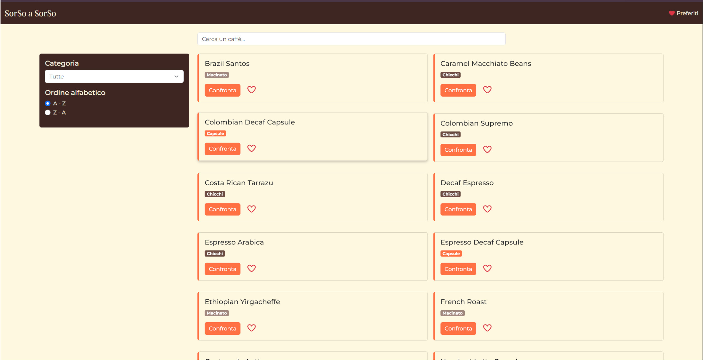
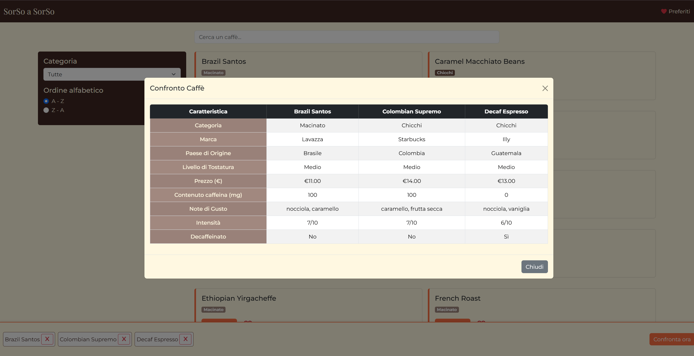

#  Comparatore di Caffè

Un sito web per confrontare, filtrare e gestire diversi tipi di caffè.  
Permette di esplorare vari prodotti, visualizzare i dettagli di ciascuno, salvare preferiti in modo persistente e confrontare più caffè fianco a fianco.

---

##  Anteprima

##  Home Page


## ⚖️ Comparatore


##  Architettura del progetto

Il progetto è suddiviso in due repository principali:

- **Frontend (React):** [progetto-finale-spec-frontend-front](https://github.com/mendozagianfranco/progetto-finale-spec-frontend-front)  
  → Gestisce l’interfaccia utente, le interazioni, la logica di comparazione e la persistenza dei preferiti tramite LocalStorage.

- **Backend (API):** [progetto-finale-spec-frontend-back](https://github.com/mendozagianfranco/progetto-finale-spec-frontend-back)  
  → Espone le API REST per fornire i dati dei caffè e le relative informazioni di dettaglio.

Il frontend comunica con il backend tramite richieste HTTP, consentendo di ottenere, filtrare e visualizzare i prodotti in modo dinamico.

---

##  Tecnologie utilizzate

### Frontend
- **React** – per la costruzione dell’interfaccia utente  
- **React Router** – per la navigazione tra le pagine  
- **Fetch API** – per la comunicazione con le API  
- **LocalStorage** – per la gestione persistente dei preferiti  
- **Bootstrap**  – per la gestione dello stile  
- **Vite** – per il build e lo sviluppo locale

### Backend
Consulta il [README del backend](https://github.com/mendozagianfranco/progetto-finale-spec-frontend-back) per i dettagli tecnici e le istruzioni d’avvio del server.

---

##  Installazione e avvio (Frontend)

### 1. Clona il repository
```bash
git clone https://github.com/mendozagianfranco/progetto-finale-spec-frontend-front.git
cd progetto-finale-spec-frontend-front
```

### 2. Installa le dipendenze
```bash
npm install
```

### 3. Avvia Applicazione
```bash
npm run dev
```
